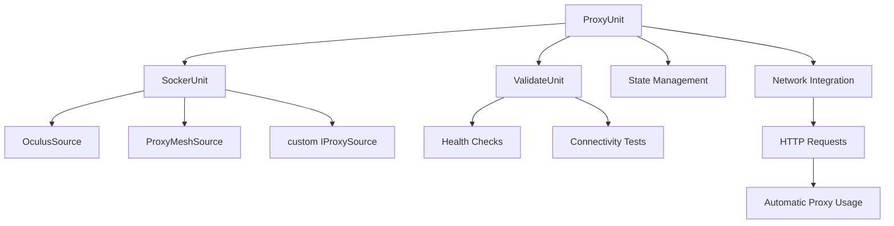

# @synet/proxy

```bash
  _____                       _    _       _ _   
 |  __ \                     | |  | |     (_) |  
 | |__) | __ _____  ___   _  | |  | |_ __  _| |_ 
 |  ___/ '__/ _ \ \/ / | | | | |  | | '_ \| | __|
 | |   | | | (_) >  <| |_| | | |__| | | | | | |_ 
 |_|   |_|  \___/_/\_\\__, |  \____/|_| |_|_|\__|
                       __/ |                     
                      |___/                      
version: 1.0.0
```

**Professional proxy pool management with automatic failover, health validation, and seamless network integration.**

## Overview

`@synet/proxy` provides enterprise-grade proxy management through Unit Architecture. The package handles proxy sourcing, pool management, health validation, and automatic rotation with zero-configuration defaults and comprehensive monitoring.

## Architecture



### Component Responsibilities

**ProxyUnit**: Core orchestrator managing pool lifecycle, statistics, and client interface
- Pool size management (default: 20 proxies)
- Automatic replenishment (30% threshold)
- Clean get/release lifecycle
- Event emission and monitoring
- Network unit integration

**SockerUnit**: Multi-source proxy provisioning with automatic failover
- Round-robin source selection
- Source health monitoring
- Graceful degradation on source failures
- Transparent proxy fetching

**ValidateUnit**: Health checking and connectivity validation
- Proxy structure validation
- Future: HTTP connectivity tests
- Future: Performance metrics
- Future: Geographic validation

## Core Concepts

### Clean Proxy Lifecycle

The proxy system provides clear methods for different usage patterns:

```typescript
// Clean acquisition - no side effects, safe for retry patterns
const proxy = await proxyUnit.get();

// Exclusive access - gets proxy AND marks as used
const proxy = await proxyUnit.exclusive();

// Mark proxy as failed and remove from pool
await proxyUnit.failed(proxy);
```

**Method Purposes:**
- `get()`: Clean, idempotent proxy retrieval for inspection/retry patterns
- `exclusive()`: Get proxy with exclusive access (marks as used + triggers replenishment)
- `failed()`: Mark proxy as failed when requests fail (removes from pool immediately)

**Real-World Usage:**
```typescript
let proxy;
try {
  proxy = await proxyUnit.exclusive(); // Get and mark as used
  const response = await http.request({ url: '/api/data', proxy });
  return response;
} catch (error) {
  if (proxy) {
    await proxyUnit.failed(proxy); // Mark as failed, remove from pool
  }
  throw error;
}
```

## Installation

```bash
npm install @synet/proxy
```

## Proxy Providers

### OculusProxies (https://oculusproxies.com/)

**API-based multi-proxy provider with geographic targeting**

**Provider Logic:**
- API-based proxy provisioning
- Supports multiple proxy types (datacenter, residential)
- Request proxies by country/region
- Returns multiple proxies per API call
- Automatic IP whitelisting required

**Configuration:**
```typescript
import { OculusSource } from '@synet/proxy';

const oculusSource = new OculusSource({
  apiToken: '4d868889-f665-426b-9bd1-d8afb7aac8dc',     // Your API token
  orderToken: 'oc_c6c8f737',                           // Your order token  
  planType: 'SHARED_DC',                               // 'SHARED_DC' | 'RESIDENTIAL'
  whiteListIP: ['182.253.163.199']                     // Your server IP(s)
});
```

**Setup Requirements:**
1. Create account at https://oculusproxies.com/
2. Purchase a proxy plan
3. Get API credentials from dashboard
4. **Add your server IP to `whiteListIP` in config**
5. Copy `private/oculus.json.example` to `private/oculus.json`

### ProxyMesh (https://proxymesh.com/)

**Single-proxy endpoint with geographic selection**

**Provider Logic:**
- Single proxy endpoint per configuration
- Select specific geographic locations
- Authentication via IP whitelisting
- Simple HTTP/HTTPS proxy protocol
- One proxy per source instance

**Configuration:**
```typescript
import { ProxyMeshSource } from '@synet/proxy';

const proxyMeshSource = new ProxyMeshSource({
  login: 'your-username',
  password: 'your-password',
  host: 'us-ca.proxymesh.com',      // Geographic endpoint
  port: 31280                       // Standard port
});
```

**Setup Requirements:**
1. Create account at https://proxymesh.com/
2. **Add your server IP to "Authenticated IPs & Hostnames" in dashboard**
3. Choose geographic endpoints (us-ca, eu-london, etc.)
4. Use endpoint-specific hosts for geographic targeting

**Available Geographic Endpoints:**
- `us-ca.proxymesh.com` - California, USA
- `us-il.proxymesh.com` - Illinois, USA  
- `us-ny.proxymesh.com` - New York, USA
- `eu-london.proxymesh.com` - London, UK
- `asia-singapore.proxymesh.com` - Singapore

## Provider Comparison

| Feature | OculusProxies | ProxyMesh |
|---------|---------------|-----------|
| **Provisioning** | API-based | Single endpoint |
| **Proxy Count** | Multiple per request | One per source |
| **Geographic** | Request by country | Choose endpoint |
| **Authentication** | IP whitelist + API tokens | IP whitelist + credentials |
| **Rotation** | Automatic pool rotation | Manual endpoint selection |
| **Best For** | High-volume, automated | Simple, geographic-specific |


## Basic Usage

### Simple Proxy Pool

```typescript
import { ProxyUnit, OculusSource } from '@synet/proxy';

// Create proxy unit with single source
const proxyUnit = ProxyUnit.create({
  sources: [
    new OculusSource({
      apiToken: 'your-api-token',
      orderToken: 'your-order-token',
      whiteListIP: ['your-ip']
    })
  ]
});

// Initialize pool
await proxyUnit.init();

// Use proxies
const proxy = await proxyUnit.get();         // Clean inspection
console.log(`Available: ${proxy.host}:${proxy.port}`);

// Get with exclusive access (marks as used)
const activeProxy = await proxyUnit.exclusive();
console.log(`Using: ${activeProxy.host}:${activeProxy.port}`);
```

### Multi-Source with Failover

```typescript
import { ProxyUnit, OculusSource, ProxyMeshSource } from '@synet/proxy';

const proxyUnit = ProxyUnit.create({
  sources: [
    // Primary: OculusProxies (API-based, multiple proxies)
    new OculusSource({
      apiToken: 'your-api-token',
      orderToken: 'your-order-token',
      planType: 'SHARED_DC',
      whiteListIP: ['your-server-ip']
    }),
    
    // Backup: ProxyMesh US West Coast
    new ProxyMeshSource({
      login: 'your-username',
      password: 'your-password',
      host: 'us-ca.proxymesh.com',
      port: 31280
    }),
    
    // Backup: ProxyMesh Europe  
    new ProxyMeshSource({
      login: 'your-username',
      password: 'your-password',
      host: 'eu-london.proxymesh.com',
      port: 31280
    })
  ],
  poolSize: 50,
  rotationThreshold: 0.2  // Replenish at 20%
});

await proxyUnit.init();

// SockerUnit automatically handles source failover
const proxy = await proxyUnit.get();
```

### Geographic Targeting

```typescript
// Target specific regions with ProxyMesh
const asianProxies = ProxyUnit.create({
  sources: [
    new ProxyMeshSource({
      login: 'username',
      password: 'password', 
      host: 'asia-singapore.proxymesh.com'
    })
  ]
});

// Request country-specific proxies with Oculus
const usProxies = ProxyUnit.create({
  sources: [
    new OculusSource({
      apiToken: 'token',
      orderToken: 'order',
      whiteListIP: ['your-ip']
    })
  ]
});

// Request US proxies specifically
const proxy = await usProxies.get({ country: 'US' });
```
  rotationThreshold: 0.2  // Replenish at 20%
});

await proxyUnit.init();

// Socker Unit automatically handles source failover
const proxy = await proxyUnit.get();
```

## Network Integration

### Automatic Proxy Usage

```typescript
import { Network } from '@synet/network';
import { ProxyUnit, OculusSource } from '@synet/proxy';

// Create proxy unit
const proxyUnit = ProxyUnit.create({
  sources: [new OculusSource({ /* config */ })]
});
await proxyUnit.init();

// Inject into network unit
const network = Network.create({
  baseUrl: 'https://api.example.com',
  proxy: proxyUnit  // Automatic proxy usage
});

// All requests automatically use proxies
const response = await network.request('/data');
```

### Manual Integration

```typescript
import { Http } from '@synet/http';

const http = Http.create({ baseUrl: 'https://httpbin.org' });

let proxy;
try {
  proxy = await proxyUnit.exclusive(); // Get with exclusive access
  
  const response = await http.request({
    url: '/ip',
    method: 'GET',
    proxy
  });
  
  console.log('Success:', response);
} catch (error) {
  if (proxy) {
    await proxyUnit.failed(proxy); // Mark proxy as failed
  }
  throw error;
}
```

## Event Monitoring

### Event Types

```typescript
type ProxyEvent = {
  type: 'pool.initialized' | 'pool.replenished' | 'pool.replenish.failed' | 
        'pool.init.failed' | 'proxy.remove.failed';
  timestamp: Date;
  error?: Error;
}
```

### Event Handling

```typescript
// Monitor all events
proxyUnit.on<ProxyEvent>('*', (event) => {
  console.log(`[${event.timestamp.toISOString()}] ${event.type}`);
  if (event.error) {
    console.error('Error:', event.error.message);
  }
});

// Specific event monitoring
proxyUnit.on<ProxyEvent>('pool.replenished', (event) => {
  console.log('Pool replenished successfully');
});

proxyUnit.on<ProxyEvent>('pool.replenish.failed', (event) => {
  console.error('Replenishment failed:', event.error?.message);
});
```

## API Reference

### ProxyUnit

#### Static Methods

```typescript
static create(config: ProxyConfig): ProxyUnit
```

#### Instance Methods

```typescript
async init(): Promise<void>
async get(criteria?: ProxyCriteria): Promise<ProxyConnection>
async exclusive(criteria?: ProxyCriteria): Promise<ProxyConnection>
async failed(proxy: ProxyConnection): Promise<void>
async validate(proxy: ProxyConnection): Promise<boolean>
async delete(proxy: ProxyConnection): Promise<void>

getStats(): ProxyStats
getPoolStatus(): PoolStatus
teach(): TeachingContract
whoami(): string
help(): void
```

### Configuration

```typescript
interface ProxyConfig {
  sources: IProxySource[];
  poolSize?: number;        // Default: 20
  rotationThreshold?: number; // Default: 0.3 (30%)
}

interface ProxyCriteria {
  country?: string;
  protocol?: 'http' | 'socks5';
  type?: 'datacenter' | 'residential';
}
```

### Statistics

```typescript
interface ProxyStats {
  poolSize: number;
  currentSize: number;
  available: number;
  lastRefresh: Date | null;
  rotationThreshold: number;
  initialized: boolean;
}

interface PoolStatus extends ProxyStats {
  shouldReplenish: boolean;
  proxies: Array<{
    id: string;
    source: string;
    used: boolean;
    age: number;
  }>;
}
```

## Proxy Sources

### OculusSource Configuration

```typescript
import { OculusSource } from '@synet/proxy';

const oculusSource = new OculusSource({
  apiToken: string;                    // Required: Your API token from dashboard
  orderToken: string;                  // Required: Your order token from dashboard  
  planType?: 'SHARED_DC' | 'RESIDENTIAL';  // Optional: Proxy type (default: 'SHARED_DC')
  whiteListIP?: string[];             // Optional: IP whitelist (recommended for security)
});
```

**Features:**
- Multiple proxies per API request
- Country-based proxy selection
- Automatic pool rotation
- Support for datacenter and residential proxies

**Geographic Criteria:**
```typescript
const proxy = await proxyUnit.get({ 
  country: 'US',           // Target specific country
  type: 'datacenter'       // 'datacenter' | 'residential'  
});
```

### ProxyMeshSource Configuration

```typescript
import { ProxyMeshSource } from '@synet/proxy';

const proxyMeshSource = new ProxyMeshSource({
  login: string;                      // Required: Your ProxyMesh username
  password: string;                   // Required: Your ProxyMesh password
  host?: string;                      // Optional: Geographic endpoint (default: 'proxymesh.com')
  port?: number;                      // Optional: Port (default: 31280)
});
```

**Features:**
- Single proxy endpoint per source
- Geographic endpoint selection
- Simple HTTP/HTTPS proxy protocol
- IP-based authentication

### Custom Sources

```typescript
interface IProxySource {
  get(count: number): Promise<ProxyItem[]>;
  remove?(id: string): Promise<void>;
  validate?(proxy: ProxyItem): Promise<boolean>;
}
```

## Error Handling

The system provides comprehensive error handling with actionable messages:

```typescript
try {
  await proxyUnit.init();
} catch (error) {
  // Error: [proxy] Proxy pool initialization failed: All proxy sources exhausted
  // Resolution: Check source configurations and API credentials
}

try {
  const proxy = await proxyUnit.get();
} catch (error) {
  // Error: [proxy] Proxy pool exhausted - replenishment in progress
  // Resolution: Wait for replenishment or increase pool size
}
```

## Advanced Usage

### Custom Validation

```typescript
const validateUnit = ValidateUnit.create({
  timeout: 10000,
  retries: 3
});

const proxyUnit = ProxyUnit.create({
  sources: [...],
  validator: validateUnit
});

// Validation happens automatically during pool management
const isValid = await proxyUnit.validate(proxy);
```

### Teaching and Learning

```typescript
// ProxyUnit can teach its capabilities to other units
const contract = proxyUnit.teach();

// Other units can learn proxy capabilities
const enhancedUnit = someUnit.learn([contract]);

// Now enhanced unit can use proxy methods
const proxy = await enhancedUnit.execute('proxy.get');
```

## Best Practices

1. **Initialize Once**: Call `init()` once during application startup
2. **Use get() for Inspection**: Clean acquisition for retry patterns and inspection
3. **Use exclusive() for Usage**: Get proxy with exclusive access when actually using
4. **Use failed() for Circuit Breaking**: Mark failed proxies for immediate removal
5. **Monitor Events**: Set up event handlers for pool health monitoring
6. **Handle Errors Gracefully**: Implement fallbacks for proxy exhaustion
7. **Configure Pool Size**: Match pool size to expected concurrent usage
8. **Set Appropriate Thresholds**: Balance between availability and API usage

### Recommended Usage Pattern

```typescript
async function makeRequest(url: string): Promise<Response> {
  let proxy;
  try {
    proxy = await proxyUnit.exclusive(); // Get with exclusive access
    return await http.request({ url, proxy });
  } catch (error) {
    if (proxy) {
      await proxyUnit.failed(proxy); // Mark as failed for circuit breaking
    }
    throw error;
  }
}
```

## Integration Patterns

### With Circuit Breakers

```typescript
import { Network } from '@synet/network';

const network = Network.create({
  proxy: proxyUnit,
  circuitBreaker: {
    failureThreshold: 3,
    resetTimeout: 30000
  }
});
```

### With Rate Limiting

```typescript
import { RateLimiter } from '@synet/rate-limiter';

const rateLimiter = RateLimiter.create({ /* config */ });
const network = Network.create({
  proxy: proxyUnit,
  rateLimiter
});
```

## Troubleshooting

### Common Setup Issues

**❌ OculusProxies: "Invalid API credentials"**
```
Error: Oculus API Error: Check your credentials
```
- Verify `apiToken` and `orderToken` in configuration
- Ensure your IP is added to `whiteListIP` array
- Check that your order is active on OculusProxies dashboard

**❌ ProxyMesh: "Authentication failed"**  
```
Error: Proxy authentication required
```
- Verify `login` and `password` credentials
- **Add your server IP to "Authenticated IPs & Hostnames" in ProxyMesh dashboard**
- Ensure you're using the correct geographic endpoint

**❌ Network connectivity issues**
```
Error: Proxy pool exhausted - replenishment in progress
```
- Check that your server can reach proxy provider APIs
- Verify firewall/security group settings allow outbound connections
- Increase `poolSize` if you have high concurrent usage

**❌ Demo not working**
```
Error: Cannot find module '../private/oculus.json'
```
- Copy `private/oculus.json.example` to `private/oculus.json`
- Fill in your actual credentials
- Ensure the file is in the correct location

### Debug Mode

Enable debug logging to troubleshoot issues:

```typescript
import { Logger } from '@synet/logger';

const logger = Logger.create({ level: 'debug' });
const proxyUnit = ProxyUnit.create({
  sources: [...],
  logger  // Add logger for debug output
});
```


### Monitoring and Observability

```typescript
// Real-time statistics
setInterval(async () => {
  const stats = proxyUnit.getStats();
  console.log(`Pool: ${stats.available}/${stats.currentSize} available`);
}, 5000);

// Health monitoring
proxyUnit.on<ProxyEvent>('pool.replenish.failed', (event) => {
  // Alert systems, trigger failover, etc.
  alerting.send({
    level: 'error',
    message: 'Proxy pool replenishment failed',
    error: event.error
  });
});
```


## Demo Setup

1. Clone
```bash
git clone https://github.com/synthetism/proxy
```

2. **Copy configuration template:**
```bash
cp packages/proxy/private/oculus.json.example packages/proxy/private/oculus.json
```

3. **Configure your credentials:**
```json
// packages/proxy/private/oculus.json
{
  "apiToken": "your-api-token",
  "orderToken": "your-order-token", 
  "whiteListIP": ["your-server-ip"]
}
```

4. **Run the demo:**
```bash
# Network + Proxy integration demo
cd packages/network
npm run demo:proxy

# Pure proxy demo  
cd packages/proxy
npm run demo
```

## Contributing

Contributions are welcome! Please read our [Contributing Guide](CONTRIBUTING.md) for details.

## Related Packages

- [`@synet/unit`](https://github.com/synthetism/unit) - Unit Architecture framework
- [`@synet/network`](https://github.com/synthetism/network) - Full network stack
- [`@synet/http`](https://github.com/synthetism/network) - HTTP client with proxy support
- [`@synet/circuit-breaker`](https://github.com/synthetism/network) - Short circuit connection with intelligent recovery
- [`@synet/rate-limiter`](https://github.com/synthetism/network) - Professional Rate Limiter with KV support
- [`@synet/retry`](https://github.com/synthetism/network) - Resilient HTTP Operations 
